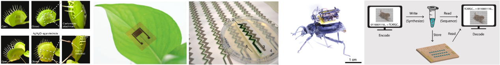

###### _(Left to Right) Living actuators, plant wearables, printed cyanobacteria, electronic beetle backpack, DNA data storage._
<!-- _(Left to Right) Living actuators, plant wearables, printed cyanobacteria, electronic beetle backpack, DNA data storage._ -->
# CSE 590 N1: Nature-Integrated Computing
### Thursdays, 4:30 - 5:30 PM @ CSE2 387 
#### University of Washington, Spring 2024


{{ staffer }}






{{ staffer }}



## Schedule

{{ module }}
