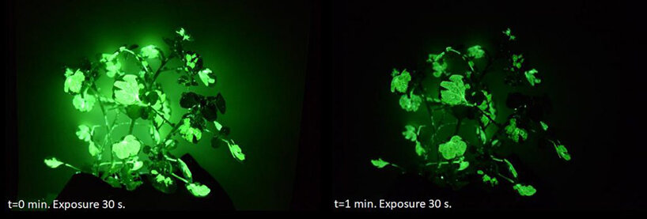

_Bioluminescent engineered plants by MIT's Strano Research Group ([source](https://www.designboom.com/technology/mit-read-light-glowing-plant-lamp-10-09-2021/))._

# Syllabus
{:.no_toc}

## Table of contents
{: .no_toc .text-delta }

1. TOC
{:toc}

---

## About This Seminar
In recent years, growing concerns about sustainability and the climate crisis have led to a surge in interest in innovative technologies. This includes the exploration of living materials, ultra-low power computing, and synthetic biology-based approaches. Engineers are focusing on developing solutions that are not only high performance, but are also biodegradable, energy-efficient, and cost-effective in terms of materials. Concurrently, designers are delving into new concepts such as posthuman or more-than-human design, with the aim of conceptualizing technologies that encourage cohabitation and interconnectedness with various species. 

Here, we consider **nature-integrated computing** to refer to technology that extends beyond environmental remediation or species conservation. It's about devising technology that integrates seamlessly with, or even harnesses, natural processes. This can involve leveraging the remarkable capabilities evolved in nature for technological advancements. The objective is to sustain or enhance our living standards, while fostering a symbiotic relationship with nature and other species in a way that positively impacts the global ecosystem.

This reading and project-based seminar aims to explore emerging themes in this space, as reflected in fields as disparate as HCI, AI/ML, computer vision, materials science, EE, and synthetic biology. We will engage with the broader global challenges being addressed, how practitioners from various fields have framed these challenges, and look at specific solutions and works in the space. 

## Objectives
The hope is that by the end of the quarter:
- We will have developed a collective understanding of what nature-integrated computing entails (technologies) and looks/feels like (applications / case studies). 
- We will have engaged with societal impacts and/or ethical considerations of developing such technologies.
- All students will have identified an interesting or actionable area for further investigation and presented a proposal or work-in-progress for a project related to their research.

## Audience
This seminar is geared for graduate-level practitioners (makers, designers, engineers, etc) interested in working with living materials in their research. Some background in an applied discipline (e.g., CS/EE/BIO) is preferred, as well as an interest in theories of technology and design.

## Logistics & Comms
- **This site** will serve as the source of truth for scheduling and agenda items.
- **Slack** will serve as an informal communication channel between classes.
- **Google Drive** will contain readings and other shared class resources.